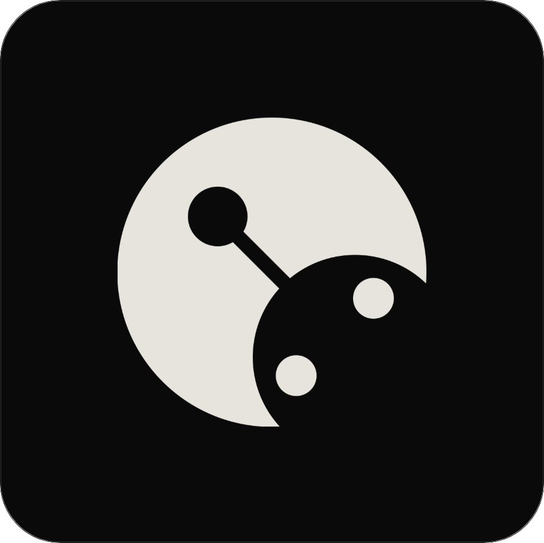
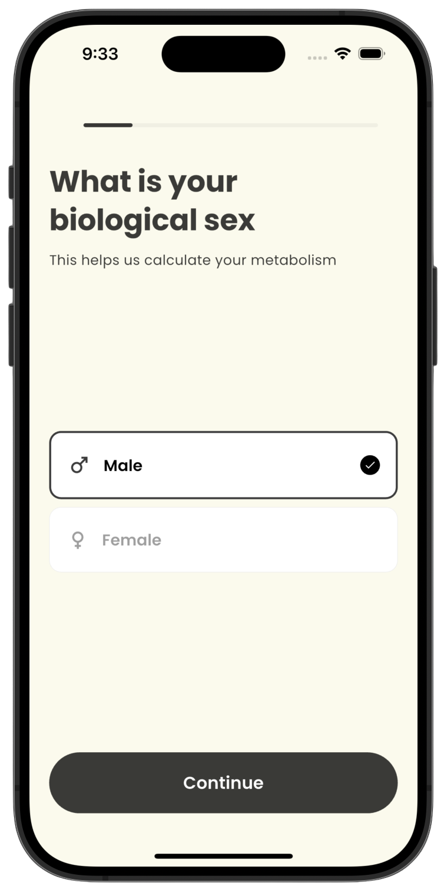
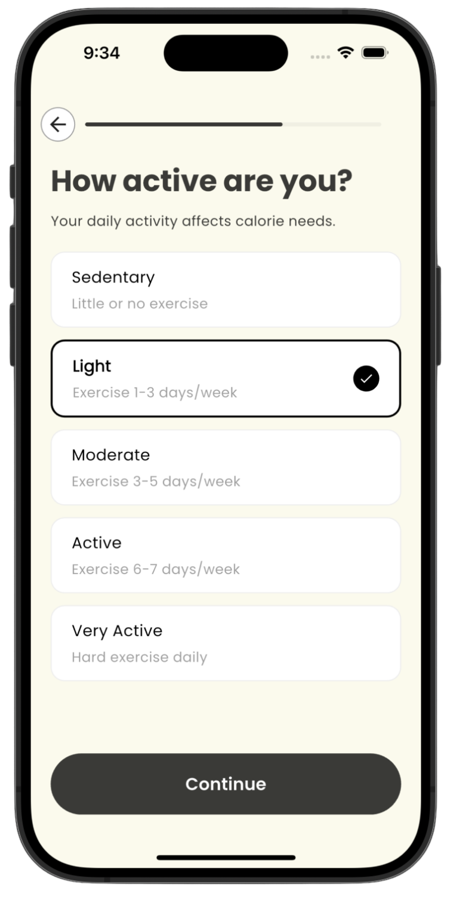
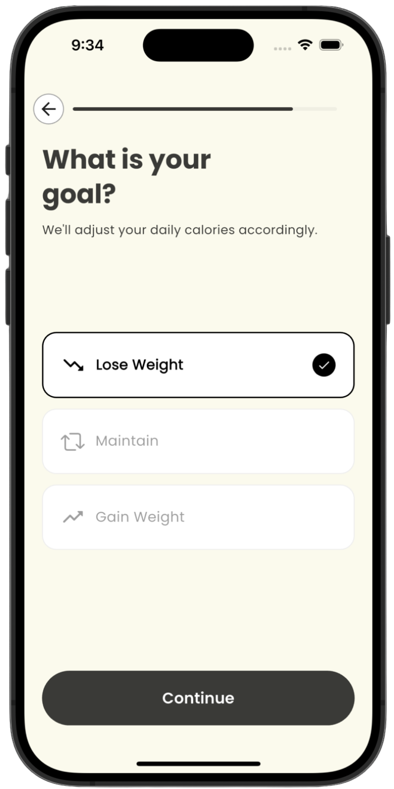
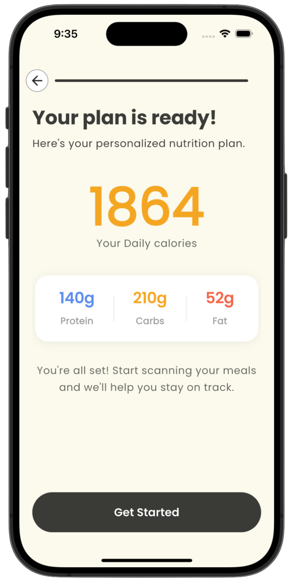
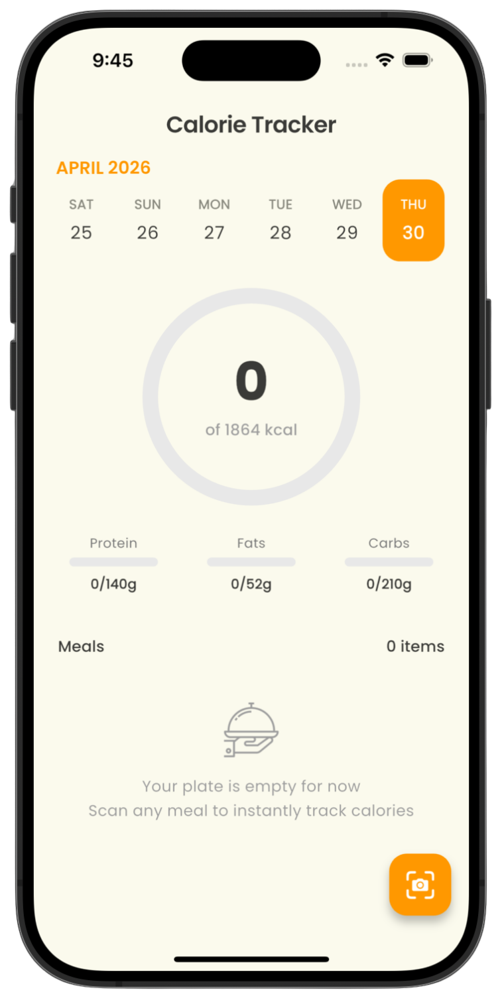
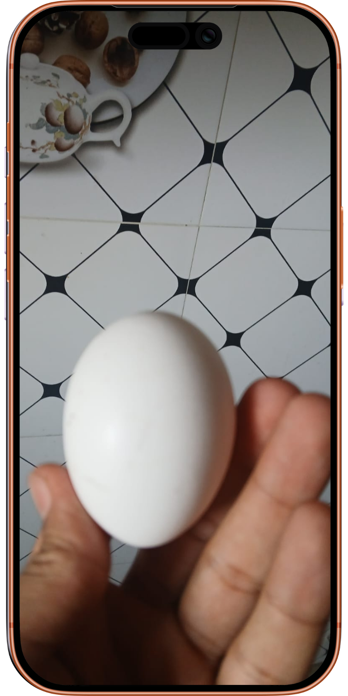
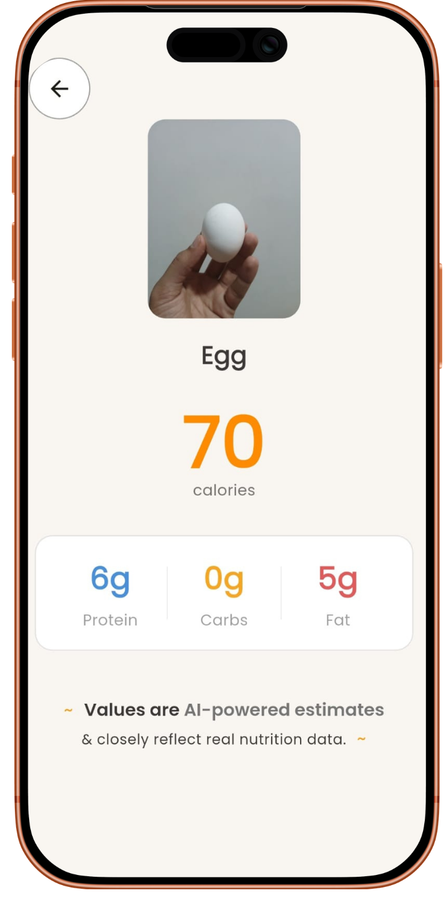
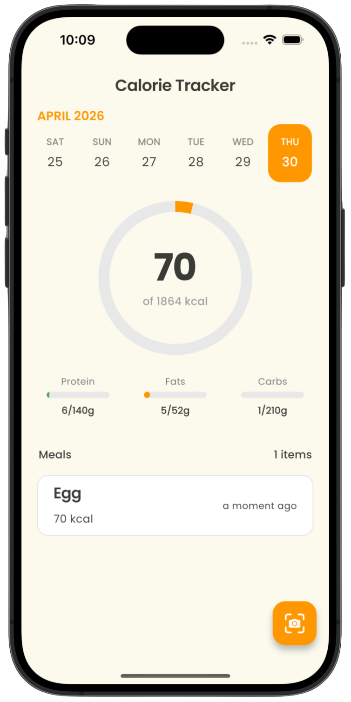

<div align="center">

<br>

 

# Food AI

**AI-Powered Calorie Tracker for Android & iOS**

Track what you eat. Understand your nutrition. Powered by AI.

<br>


<br>

</div>

---

## Overview

Food AI is a Flutter mobile app that uses artificial intelligence to make calorie tracking effortless. Photograph your meal, and Cal AI instantly estimates nutritional information — no manual logging required.

---

## Screenshots

<table>
  <tr>
    <th align="center">Onboarding</th>
    <th align="center">Calorie Log & Tracking</th>
  </tr>
  <tr>
    <td align="center">
      
      
      
      <br/>
      
      
      
    </td>
    <td align="center">
      
      
      <br/>
      
      
    </td>
  </tr>
</table>

---

## Features

| Feature                     | Description                                                                                 |
| --------------------------- | ------------------------------------------------------------------------------------------- |
| **AI Meal Recognition**     | Snap a photo of your food — Cal AI identifies the item and estimates calories automatically |
| **Daily Calorie Dashboard** | Clean summary of your daily intake vs your personal calorie goal                            |
| **Macro Breakdown**         | Track proteins, carbohydrates, and fats alongside total calories                            |
| **Meal History Log**        | Full history of logged meals with timestamps and nutritional details                        |
| **Personalized Goals**      | Set custom calorie and macro targets based on your health goals                             |
| **Nutritional Insights**    | AI-generated tips based on your eating patterns                                             |
| **Lightweight & Fast**      | Smooth, native experience on both Android and iOS                                           |

---

## Tech Stack

| Layer            | Technology         |
| ---------------- | ------------------ |
| Framework        | Flutter (Dart)     |
| AI / NLP         | Grok AI            |
| State Management | Cubit              |
| Local Storage    | Shared Preferences |
| UI Components    | Material Design 3  |

---

## Getting Started

### Prerequisites

- [Flutter SDK](https://docs.flutter.dev/get-started/install) v3.0 or higher
- [Dart](https://dart.dev/get-dart) — bundled with Flutter

### Installation

**1. Clone the repository**

```bash
git clone https://github.com/azar99ahemad/food-ai
```

**2. Install dependencies**

```bash
flutter pub get
```

**3. Configure environment variables**

Add your API key to the `.env` file in the root directory:

```env
GROK_API_KEY=your_api_key_here
```

**4. Run the app**

```bash
flutter run
```

---

## Project Structure

```
cal-ai/
├── lib/
│   ├── main.dart           # App entry point
│   ├── screens/            # UI screens
│   ├── widgets/            # Reusable UI components
│   ├── models/             # Data models
│   ├── services/           # API & AI services
│   └── utils/              # Helper functions
├── assets/
│   └── images/             # App images & icons
├── test/                   # Unit & widget tests
├── pubspec.yaml            # Dependencies
└── README.md
```

---

## Contributing

Contributions are welcome. To get started:

1. Fork the repository
2. Create a new branch — `git checkout -b feature/your-feature-name`
3. Commit your changes — `git commit -m 'Add some feature'`
4. Push to the branch — `git push origin feature/your-feature-name`
5. Open a Pull Request

---

## License

This project is licensed under the [MIT License](LICENSE).

---


